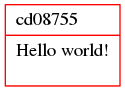
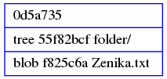
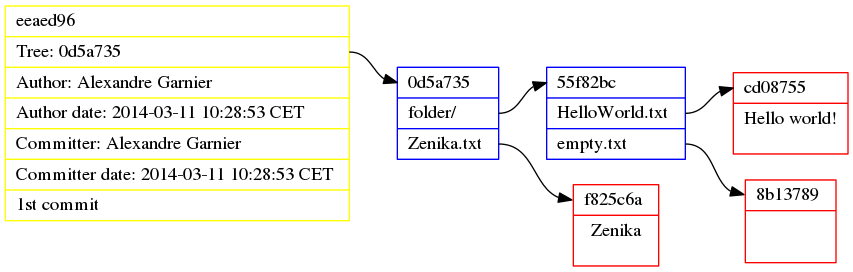
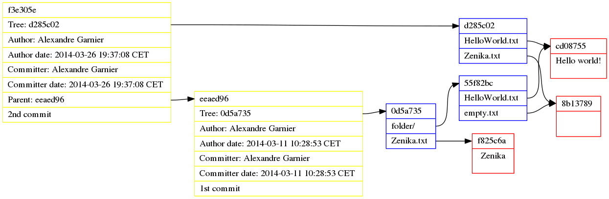

# La plomberie de Git

<!-- .slide: class="page-title" -->


## Les objets Git

Le principe de Git est simplement de stocker les contenus et de les identifier par leur hash SHA1.

Les contenus stockables sont répartis en 3 types :

- Blob
- Tree
- Commit


## Blob

Représentation du contenu d'un fichier et uniquement le contenu.

<figure>
    
</figure>

Pour créer un blob :
```shell
$ echo 'Hello world!' | git hash-object --stdin -w
cd0875583aabe89ee197ea133980a9085d08e497
```

Pour lire le contenu d'un blob :
```shell
$ git cat-file -p cd08755
Hello world!
```


## Plus de blobs

Ajoutons encore quelques blobs :
```shell
$ echo '' | git hash-object --stdin -w
8b137891791fe96927ad78e64b0aad7bded08bdc

$ echo 'Zenika' | git hash-object --stdin -w
f825c6ac4780ce6b1ba465167167bfaffe8a6e93
```


## Tree

Représentation d'un dossier.

Liste des :

- fichiers et le blob de leur contenu
- sous-dossiers et leur tree

<figure>
    
</figure>


## Création de tree

Pour créer un tree :
```shell
$ echo -e "100644 blob cd0875583aabe89ee197ea133980a9085d08e497\tHelloWorld.txt
100644 blob 8b137891791fe96927ad78e64b0aad7bded08bdc\tempty.txt"\
 | git mktree
55f82bcf8364111553db85ffd35f3047dcbb237f
```

Pour vérifier le contenu d'un tree :
```shell
$ git cat-file -p 55f82bc
100644 blob cd0875583aabe89ee197ea133980a9085d08e497	HelloWorld.txt
100644 blob 8b137891791fe96927ad78e64b0aad7bded08bdc	empty.txt
```
Ou bien encore :
```shell
$ git ls-tree --abbrev 55f82bc
100644 blob cd08755	HelloWorld.txt
100644 blob 8b13789	empty.txt
```


## Tree inception

Créons une vraie arborescence :
```shell
$ echo -e "100644 blob f825c6ac4780ce6b1ba465167167bfaffe8a6e93\tZenika.txt
040000 tree 55f82bcf8364111553db85ffd35f3047dcbb237f\tfolder"\
 | git mktree
0d5a735b5fd6ec5366e94f5380e15c3f88d03935
```

```shell
$ git ls-tree -r --abbrev 0d5a735
100644 blob f825c6a	Zenika.txt
100644 blob cd08755	folder/HelloWorld.txt
100644 blob 8b13789	folder/empty.txt
```


## Commit

Sauvegarde d'un tree racine avec des méta-données :

- Auteur et date
- Commiteur et date
- Message
- Parents éventuels

<figure>
    
</figure>


## Création de commit

Pour créer un commit :
```shell
$ echo 'tree 0d5a735b5fd6ec5366e94f5380e15c3f88d03935
author Alexandre Garnier <alexandre.garnier@zenika.com> 1394530133 +0100
committer Alexandre Garnier <alexandre.garnier@zenika.com> 1394530133 +0100

1st commit' | git hash-object -t commit --stdin -w
eeaed96b54b42657303b5d3eb7f6bf1b72fab94a
```

Affichage d'un commit :
```shell
$ git cat-file -p eeaed96
tree 0d5a735b5fd6ec5366e94f5380e15c3f88d03935
author Alexandre Garnier <alexandre.garnier@zenika.com> 1394530133 +0100
committer Alexandre Garnier <alexandre.garnier@zenika.com> 1394530133 +0100

1st commit
```


## Résultat

Affichage du commit
```shell
$ git show eeaed96
commit eeaed96b54b42657303b5d3eb7f6bf1b72fab94a
Author: Alexandre Garnier <alexandre.garnier@zenika.com>
Date:   Tue Mar 11 10:28:53 2014 +0100

    1st commit

diff --git a/Zenika.txt b/Zenika.txt
new file mode 100644
index 0000000..f825c6a
--- /dev/null
+++ b/Zenika.txt
@@ -0,0 +1 @@
+Zenika
diff --git a/folder/HelloWorld.txt b/folder/HelloWorld.txt
new file mode 100644
index 0000000..cd08755
--- /dev/null
+++ b/folder/HelloWorld.txt
@@ -0,0 +1 @@
+Hello world!
diff --git a/folder/empty.txt b/folder/empty.txt
new file mode 100644
index 0000000..8b13789
--- /dev/null
+++ b/folder/empty.txt
@@ -0,0 +1 @@
+
```


## Résultat

<figure>
    
</figure>


## Dans le monde réel
Et on se place sur le commit :
```shell
$ git update-ref refs/heads/master eeaed96
$ tree
.

0 directories, 0 files
```
Les contenus n'ont jamais existé dans le monde réel !
```shell
$ git checkout
$ tree
.
├── folder
│   ├── empty.txt
│   └── HelloWorld.txt
└── Zenika.txt

1 directory, 3 files
```


## Encore plus

Modifications et nouveau commit :
```shell
$ echo -e "100644 blob cd0875583aabe89ee197ea133980a9085d08e497\tHelloWorld.txt
100644 blob 8b137891791fe96927ad78e64b0aad7bded08bdc\tZenika.txt"\
 | git mktree
d285c028104fbb7f6660124ec3d6d6ce71931a19

$ echo 'tree d285c028104fbb7f6660124ec3d6d6ce71931a19
parent eeaed96b54b42657303b5d3eb7f6bf1b72fab94a
author Alexandre Garnier <alexandre.garnier@zenika.com> 1395859028 +0100
committer Alexandre Garnier <alexandre.garnier@zenika.com> 1395859028 +0100

2nd commit' | git hash-object -t commit --stdin -w
f3e305e8e299c36370302a7b695d457c2aa14a7a

$ git update-ref refs/heads/master f3e305e
```


## Résultat

<figure>
    
</figure>
