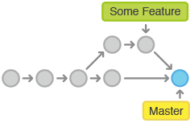
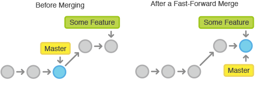

# Merge

<!-- .slide: class="page-title" -->

## Principe

Un moment il faut réconcilier les modifications effectuées sur les branches.

Le moyen classique pour le faire est de merger les branches entre elles.

<figure>
    
</figure>

## Merge avec Git

Grâce au graphe orienté acyclique des commits, calculer un merge est très facile pour Git :

- Déterminer l'ancêtre commun entre la branche courante et la branche à merger : la base
- Calculer le diff entre la base et la branche à merger
- Appliquer le diff sur la branche courante
- Commiter le résultat dans un commit ayant comme 1er parent la branche courante et comme 2ème parent la branche à merger

## Conflit de merge

Il est évidemment possible que le diff ne s'applique pas sans conflit :

- Modifications différentes des mêmes lignes dans le même fichier
- Modification d'un fichier d'un côté et suppression de l'autre
- Création du même fichier des 2 côtés

Il faut alors modifier les fichiers en conflit et les indexer pour les marquer comme résolus puis commiter.

## Fast-forward

Si la branche courante n'a pas de divergence par rapport à la branche à merger, le merge peut alors être *fast-forward*, c'est-à-dire qu'il suffit de déplacer la branche courante sur la branche à merger.

<figure>
    
</figure>

Ce comportement peut ne pas être voulu et il suffit alors d'utiliser l'option `--no-ff`.
