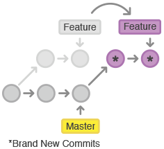

# Rebase

<!-- .slide: class="page-title" -->


## Principe

Le rebase est une autre méthode de mise à jour d'une branche par rapport à une autre qui consiste à rejouer chacun des commits de la branche courante à la suite de la branche dont on veut se mettre à jour.

<figure>
    
</figure>


## Autre situation

C'est aussi un moyen de déplacer une branche qui a démarrée au mauvais endroit.
```
o---o---o---o---o  master
     \
      o---o---o---o---o  next
               \
                o---o---o  topic
```
```shell
$ git rebase --onto master next topic
```
```
o---o---o---o---o  master
    |            \
    |             o'--o'--o'  topic
     \
      o---o---o---o---o  next
```


## Conflit de rebase

Il est évidemment possible que le cherry-pick des commits ne se passe pas sans conflit.

L'avantage ici est que la résolution des conflits se fait dans chaque nouveau commit :

- plusieurs petits conflits sucessifs plutôt qu'un seul conflit de merge
- "comme si" le commit était correct depuis le début

Dans ce cas, il faut modifier les fichiers en conflit et les indéxer pour les marquer comme résolus puis continuer le rebase avec un `git rebase --continue`.

Il est aussi possible d'abandonner le rebase avec un `git rebase --abort` qui nous ramène à l'état avant le rebase.


## Rebase interactif

Git propose de diriger la façon dont les commits vont être rejoués :

- Changer le message d'un commit
- Changer le contenu d'un commit
- Créer un nouveau commit
- Fusionner 2 commits en 1 seul
- Changer l'ordre des commits
- Sauter un commit
- Executer une commande


## Exemple

```git-rebase
pick eeaed96 1st commit
exec mvn clean test
pick f3e305e 2nd commit
fixup 6c68d48 fixup! 2nd commit # 4th commit
edit 3568a7f 5th commit
reword e8353bb 3rd commit

# Rebase 3568a7f onto 16d02a0
# Commands:
#  p, pick = use commit
#  r, reword = use commit, but edit the commit message
#  e, edit = use commit, but stop for amending
#  s, squash = use commit, but meld into previous commit
#  f, fixup = like "squash", but discard this commit's log message
#  x, exec = run command (the rest of the line) using shell
#
# These lines can be re-ordered; they are executed from top to bottom.
# If you remove a line here THAT COMMIT WILL BE LOST.
# However, if you remove everything, the rebase will be aborted.
# Note that empty commits are commented out
```


## Pourquoi rebaser ?

Quel historique est plus sympa ?

Mise à jour avec des merges :
```
o---o---o---o---o---o---o---o---o-----------o
 \       \       \   \           \         /
  o---o---o---o---o---o---o---o---o---o---o
```

Mise à jour avec des rebases :
```
o---o---o---o---o---o---o---o---o-------------------o
                         \                         /
                          o---o---o---o---o---o---o
```

=> Pas de commit technique de mise à jour mixant plusieurs résolutions de conflit.


## Avoir un historique de pro

Le rebase permet aussi de retravailler localement votre historique pour avoir un historique parfait comme un pro.

Vous pouvez ainsi faire "comme si" vous aviez tout fait parfaitement au premier coup (ce qui n'est jamais le cas, avouez-le).

Pour cela :

1. Commiter n'importe comment
2. Faire des `commit --amend` quand possible sinon faire des `commit --fixup <commit>`
3. Lancer un `git rebase --interactif --autosquash`
4. Réarranger son historique
5. Terminer son rebase
6. Pousser un magnifique historique et briller auprès de vos collègues
